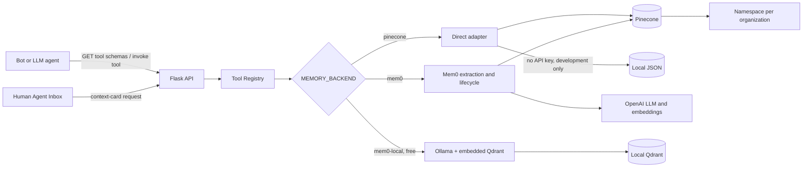
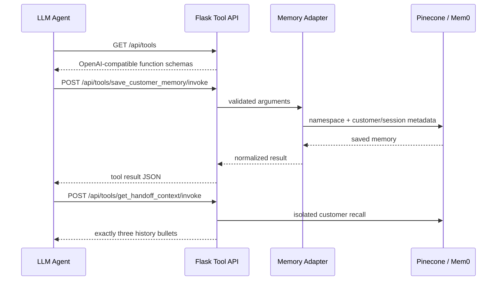

# Architecture and request flow

The application is a Flask service. Bots, LLM agents, and the Human Agent Inbox
all call the same HTTP API. The service can use direct Pinecone or Mem0 OSS over
Pinecone without changing callers.

## Components

## Tool-calling flow

## Isolation model

1. `organization_id` becomes a Pinecone namespace.
2. `mobile_no` is normalized to a stable `+<digits>` identity.
3. Direct Pinecone searches always include the mobile metadata filter.
4. Mem0 hashes `organization_id:mobile_no` into an opaque `user_id` and also
   uses the organization namespace.
5. Optional `session_id` filters narrow recall to one conversation.

## Flask tool endpoints

- `GET /api/tools` returns function schemas usable by an LLM tool loop.
- `POST /api/tools/save_customer_memory/invoke` writes memory.
- `POST /api/tools/search_customer_memory/invoke` retrieves relevant memory.
- `POST /api/tools/get_handoff_context/invoke` creates the three-bullet card.

The caller remains responsible for its model loop: send the schemas to the LLM,
execute the selected Flask endpoint, then return the JSON tool result to the LLM.
This keeps model vendors outside the core service and makes the tool API usable
from OpenAI, Anthropic, or an internal orchestration layer.

## Request security

When `SERVICE_API_KEY` is configured, every memory and tool request must include
`X-API-Key`. Flask compares it in constant time. In production, terminate TLS at
the load balancer/API gateway and use the organization's identity and rate-limit
policies in addition to this service-level key.
