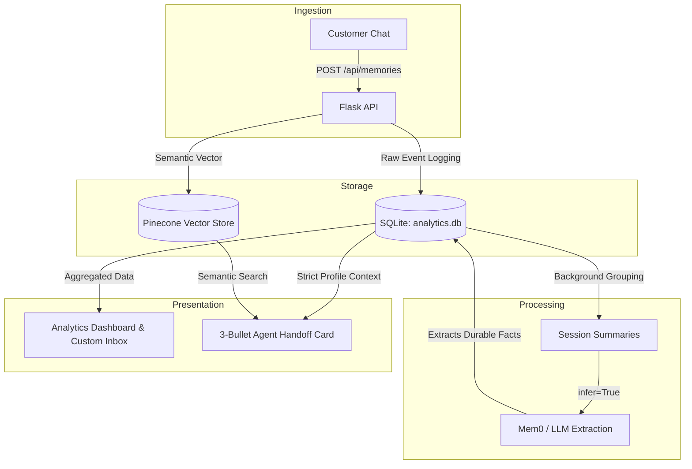
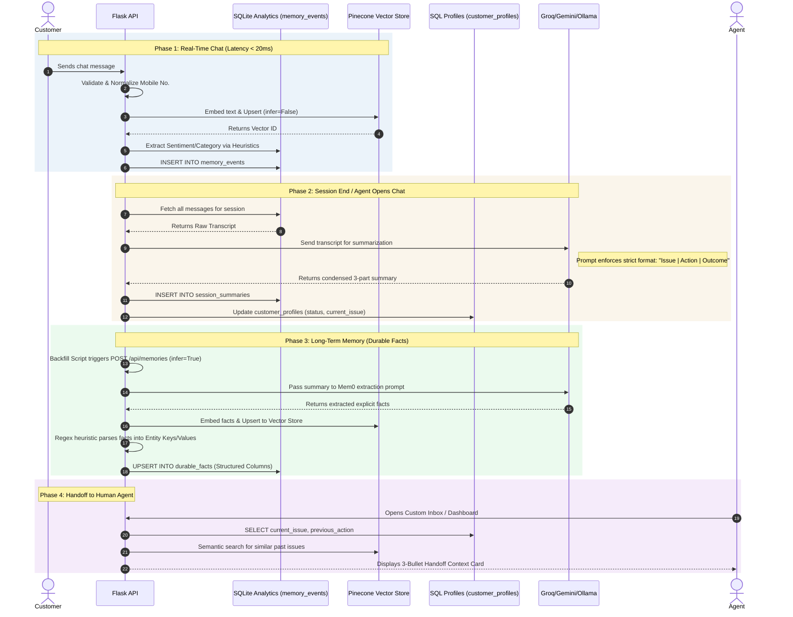

# QuickTalk Organizational Memory Service

A small Flask service that gives contact-center agents persistent customer
memory backed by Pinecone. Every memory is associated with an organization,
session, mobile number, and timestamp. The Human Agent Inbox displays an
exactly three-bullet handoff summary before the agent replies.

## Features

- Organization isolation through one Pinecone namespace per organization
- Customer isolation through normalized mobile-number metadata filters
- Decoupled `core/` pipeline: Sanitizer -> CoT Summarizer -> Mem0 Engine
- Session-aware memory storage and semantic retrieval
- Three-bullet Agent Handoff Context Card backed by structured facts
- Local JSON fallback for development without Pinecone credentials
- Optional Mem0 OSS extraction and lifecycle infrastructure on Pinecone
- Responsive Human Agent Inbox demo
- API validation and isolation tests
- Flask-native tool calling with model-compatible JSON schemas

## Quick start

```bash
python -m venv .venv
# Windows: .venv\Scripts\activate
# macOS/Linux: source .venv/bin/activate
pip install -r requirements.txt
python flask_app.py
```

Open <http://localhost:8765>. The app uses a local fallback until
`PINECONE_API_KEY` is set.

## Pinecone setup

Create a dense cosine index with 384 dimensions, then configure:

```env
PINECONE_API_KEY=your-key
PINECONE_INDEX=quicktalk-memories
PINECONE_DIMENSION=384
PORT=8765
SERVICE_API_KEY=generate-a-long-random-secret
```

Copy `.env.example` to `.env`; `.env` is excluded from Git. See
[FLASK_PINECONE_SERVICE.md](FLASK_PINECONE_SERVICE.md) for API examples and
implementation details.

## Enable Mem0 infrastructure

Mem0 can replace the direct vector adapter while preserving the same Flask API:

```env
MEMORY_BACKEND=mem0
OPENAI_API_KEY=your-openai-key
PINECONE_API_KEY=your-pinecone-key
MEM0_PINECONE_INDEX=quicktalk-mem0
```

The Mem0 adapter creates a separate Pinecone namespace for every organization
and hashes `organization_id + mobile_no` into its `user_id`. Session, mobile,
role, and timestamp remain attached as metadata. Keep `MEMORY_BACKEND=pinecone`
for the deterministic direct-Pinecone/local mode.

### Production Pipeline Refactor
The memory pipeline has been refactored into a decoupled architecture to prevent Mem0 hallucination and context bloat:
1. **`core/sanitizer.py`**: Scrubs bot greetings and technical system errors from raw transcripts.
2. **`core/summarizer.py`**: Uses a Chain-of-Thought JSON prompt with Groq (`llama-3.1-8b-instant`) to extract precise 15-word `issue`, `action`, and `outcome` fields.
3. **`mem0_memory.py` / `core/memory_engine.py`**: Configured with a `STRICT_MEMORY_EXTRACTION_PROMPT` and `limit=3` on retrieval to enforce signal-to-noise ratio before hitting Pinecone.

The Flask API endpoints (`/api/profiles`, `/api/inbox/context-card`, and `/api/inbox/welcome`) securely enforce mobile normalization and draw directly from the structured `analytics` pipeline rather than raw vector search.

### Recent Structural Fixes
To resolve context isolation and memory leakage, the following core orchestrations were recently patched:
- **Strict Mobile Normalization**: Enforced `normalize_mobile()` globally within `analytics.get_profile()` to stop format mismatches from silently returning empty profiles.
- **Routing Priority**: `get_contextual_welcome` now prioritizes the strictly computed analytics profile over raw Mem0 data, preventing generic greetings from masking actual customer issues.
- **Handoff Noise Filtering**: Deduplicates and scrubs (`is_greeting`) raw `mem0_facts` before rendering them in the agent handoff context card.
- **Targeted Mem0 Lifecycle**: Memory extraction (`infer=True`) is correctly tagged with `metadata={"memory_type": "session_summary"}` and checked prior to push, avoiding redundant syncs on live-chat metadata. Individual message inserts via `save_customer_memory` now default to `infer=False` to prevent noisy, fragmented memories and LLM rate-limit exhaustion.
- **Asynchronous Processing**: Shifted the Mem0 escalation push to a background thread to unblock the `GET /api/inbox/context-card` request path.
- **Qdrant Vector Storage**: Migrated off Pinecone to a purely local Qdrant vector store (`mem0-groq-local`) to bypass cloud credential issues while still utilizing Groq's high-speed inference for summary generation.
- **System Role Enforcement**: LLM-generated session summaries are now pushed to Mem0 under the `role="system"` (instead of `customer`) so Mem0 correctly extracts durable facts without confusing them for raw conversational filler.

## Fully free mode

Use local Ollama for extraction and embeddings and embedded Qdrant for vectors:

```env
MEMORY_BACKEND=mem0-local
OLLAMA_BASE_URL=http://localhost:11434
MEM0_LOCAL_LLM_MODEL=llama3.2:1b
MEM0_LOCAL_EMBEDDING_MODEL=nomic-embed-text:latest
MEM0_LOCAL_EMBEDDING_DIMENSION=768
MEM0_LOCAL_INFER=false
```

Install Ollama, then download the two free models:

```bash
ollama pull llama3.2:1b
ollama pull nomic-embed-text
```

This mode makes no OpenAI or Pinecone calls. By default, Mem0 stores messages
directly (`MEM0_LOCAL_INFER=false`) because very small local chat models do not
always produce Mem0's strict extraction JSON. Set `MEM0_LOCAL_INFER=true` when
using a stronger local model. The default mode still performs real semantic
embedding and retrieval through Ollama and Qdrant. It is suitable for local
testing and small single-machine deployments. Use Mem0 + Pinecone for
horizontally scaled production after adding a Pinecone free-tier or paid API key.

Run the real zero-cost Flask/Mem0/Ollama/Qdrant test:

```bash
python free_integration_test.py
```

See [FREE_MODE_REPORT.md](FREE_MODE_REPORT.md) for the tested path and the
difference between this free local proof and a live Pinecone connection.

When Flask runs in Docker but Ollama runs on the host, set
`OLLAMA_BASE_URL=http://host.docker.internal:11434` and mount `/app/data` as a
persistent volume for Qdrant and Mem0 history.

### Pinecone free tier with no OpenAI

Use Pinecone for the real vector infrastructure while keeping inference and
embeddings local and free:

```env
MEMORY_BACKEND=mem0-pinecone-free
PINECONE_API_KEY=your-free-tier-key
MEM0_FREE_PINECONE_INDEX=quicktalk-mem0-free
PINECONE_CLOUD=aws
PINECONE_REGION=us-east-1
OLLAMA_BASE_URL=http://localhost:11434
MEM0_LOCAL_LLM_MODEL=llama3.2:1b
MEM0_LOCAL_EMBEDDING_MODEL=nomic-embed-text:latest
MEM0_LOCAL_EMBEDDING_DIMENSION=768
MEM0_LOCAL_INFER=false
```

This path is Flask → Mem0 → Ollama embeddings → Pinecone. It does not call
OpenAI. Pinecone still requires a free account and API key for authentication.

After configuring `.env`, run the real cloud integration:

```bash
python pinecone_integration_test.py
```

See [PINECONE_LIVE_TEST_REPORT.md](PINECONE_LIVE_TEST_REPORT.md) for the
verified free-tier test path and result.

## Google Gemini Free Tier Integration (Efficient & High Performance)

For production-grade testing without subscription fees, you can use the **Google Gemini API** (Google AI Studio Free Tier). This uses **Gemini 1.5 Flash** for instruction-following and Roman Urdu comprehension, alongside the state-of-the-art **`text-embedding-004`** model.

To enable this on the `gemini-integration` branch, configure these variables in your `.env` file:

```env
# Enable Gemini for Mem0 long-term memory
MEMORY_BACKEND=mem0-gemini
MEM0_GEMINI_MODEL=gemini-1.5-flash
MEM0_GEMINI_EMBEDDING_MODEL=models/text-embedding-004
MEM0_EMBEDDING_DIMENSION=768
MEM0_PINECONE_INDEX=quicktalk-mem0-free

# Enable Gemini for real-time session summaries
GEMINI_SUMMARIZER_ENABLED=true

# Add your Gemini API key (copied from aistudio.google.com)
GEMINI_API_KEY=your-gemini-api-key-here
GOOGLE_API_KEY=your-gemini-api-key-here

# Pinecone key is still required for the vector database layer
PINECONE_API_KEY=your-pinecone-key
```

## System Architecture & How It Works

To support live production workloads, the system separates real-time operations (low latency) from long-term memory synthesis (high quality):

### 1. Two-Tier Memory Write Strategy
*   **Real-time Writes (Live Chat)**: When customer or support messages arrive, they are saved instantly to the local SQLite database (`memory_events` table) and logged to the vector database (`Mem0` + `Pinecone`) with `infer=False`. **This bypasses LLM inference entirely during live chat, keeping write latency under 20ms.**
*   **Session-End Synthesis (Escalation & Handoff)**: When a support agent opens a customer or escalates a chat, the system compiles the entire session transcript into a structured summary:
    `Issue: <Initial customer issue> Action: <Last support action> Outcome: <Customer response>`
    This clean, consolidated summary is pushed to Mem0 with `infer=True`, triggering the Gemini API to extract high-level, durable user preferences and facts.

### 2. High-Performance SQLite Caching
*   To prevent redundant LLM/Ollama network requests, the system stores computed session summaries in SQLite.
*   Upon profile fetching, it checks the database. If the message count of a session matches the cached count, it reuses the summary instantly (0ms latency), making profile switching in the dashboard extremely fast.

### 3. Typo-Tolerant Greeting Filtering
*   Common Urdu, Arabic, and English greeting inputs and typos (e.g. `aoa`, `salam`, `Asalamad u aliakum`, `hello`) are automatically detected and filtered using the `is_greeting` classifier.
*   This prevents greeting noise from showing up in your vector database or appearing in the contextual greeting welcome message.

## API overview

| Method | Endpoint | Purpose |
|---|---|---|
| `GET` | `/api/health` | Service and backend status |
| `POST` | `/api/memories` | Save a customer or assistant memory |
| `GET` | `/api/memories` | Search isolated customer memories |
| `GET` | `/api/inbox/context-card` | Return the three handoff bullets |
| `GET` | `/api/tools` | Return agent function/tool schemas |
| `POST` | `/api/tools/<name>/invoke` | Execute a memory tool |

For production, set `SERVICE_API_KEY` and send it in the `X-API-Key` header.
Health and the static inbox page remain public; memory and tool endpoints are
protected. Place the service behind TLS and your normal gateway/identity layer.

See [ARCHITECTURE.md](ARCHITECTURE.md) for the component diagram, request
sequence, isolation boundaries, and tool-calling lifecycle.

## Test

```bash
python -m unittest -v test_flask_service.py
```

## Docker

```bash
docker build -t quicktalk-memory .
docker run --rm -p 8765:8765 --env-file .env quicktalk-memory
```

## Architecture



### Detailed Sequence Diagram



For production, replace the deterministic demo embedding function with the
organization's approved embedding model and create the Pinecone index using
that model's vector dimension.
# Auto-approved human-agent knowledge

The Flask service includes an organization knowledge manager at `/knowledge`.
Every verified human-agent portal chat is stored when closed, converted into a
redacted reusable question/answer, automatically approved, and indexed for
live bot retrieval. PostgreSQL-compatible SQLite tables remain authoritative;
Pinecone/Mem0 is the retrieval projection.

Live retrieval order is approved organization knowledge first, followed by
customer-specific Mem0 conversation history. Organization administrators can
edit an answer (creating a newer automatically active version), disable it,
delete it, or restore it. Superseded versions remain in the audit record and
are rejected during retrieval.

Main endpoints:

- `POST /api/agent-chats`
- `POST /api/agent-chats/<id>/messages`
- `POST /api/agent-chats/<id>/close`
- `GET /api/knowledge/articles`
- `PATCH /api/knowledge/articles/<id>`
- `POST /api/knowledge/articles/<id>/status`
- Flask tool: `search_approved_knowledge`

# Historical JSON Import & Bot Training
A heavy-duty backfill script `import_agent_history.py` is included in the project root to securely ingest large JSON dumps (e.g., thousands of historical chat sessions) into the SQL tables and Mem0 vector space.
- **Bulk Insert:** Raw events are securely batched into `analytics.db`.
- **Mem0 Extraction:** Session summaries are pushed to Mem0 using `infer=True` with exponential backoff to respect Groq/Gemini LLM API rate limits. 
- **LLM Tool Execution:** Autonomous agents can trigger this 3-hour extraction task asynchronously using the `import_agent_history_from_json` tool found in `tool_calling.py`.
