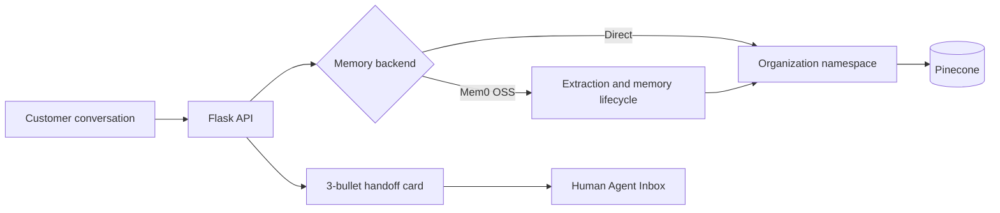

# QuickTalk Organizational Memory Service

A small Flask service that gives contact-center agents persistent customer
memory backed by Pinecone. Every memory is associated with an organization,
session, mobile number, and timestamp. The Human Agent Inbox displays an
exactly three-bullet handoff summary before the agent replies.

## Features

- Organization isolation through one Pinecone namespace per organization
- Customer isolation through normalized mobile-number metadata filters
- Session-aware memory storage and semantic retrieval
- Three-bullet Agent Handoff Context Card
- Local JSON fallback for development without Pinecone credentials
- Optional Mem0 OSS extraction and lifecycle infrastructure on Pinecone
- Responsive Human Agent Inbox demo
- API validation and isolation tests
- Flask-native tool calling with model-compatible JSON schemas

## Quick start

```bash
python -m venv .venv
# Windows: .venv\Scripts\activate
# macOS/Linux: source .venv/bin/activate
pip install -r requirements.txt
python flask_app.py
```

Open <http://localhost:8765>. The app uses a local fallback until
`PINECONE_API_KEY` is set.

## Pinecone setup

Create a dense cosine index with 384 dimensions, then configure:

```env
PINECONE_API_KEY=your-key
PINECONE_INDEX=quicktalk-memories
PINECONE_DIMENSION=384
PORT=8765
SERVICE_API_KEY=generate-a-long-random-secret
```

Copy `.env.example` to `.env`; `.env` is excluded from Git. See
[FLASK_PINECONE_SERVICE.md](FLASK_PINECONE_SERVICE.md) for API examples and
implementation details.

## Enable Mem0 infrastructure

Mem0 can replace the direct vector adapter while preserving the same Flask API:

```env
MEMORY_BACKEND=mem0
OPENAI_API_KEY=your-openai-key
PINECONE_API_KEY=your-pinecone-key
MEM0_PINECONE_INDEX=quicktalk-mem0
```

The Mem0 adapter creates a separate Pinecone namespace for every organization
and hashes `organization_id + mobile_no` into its `user_id`. Session, mobile,
role, and timestamp remain attached as metadata. Keep `MEMORY_BACKEND=pinecone`
for the deterministic direct-Pinecone/local mode.

## Fully free mode

Use local Ollama for extraction and embeddings and embedded Qdrant for vectors:

```env
MEMORY_BACKEND=mem0-local
OLLAMA_BASE_URL=http://localhost:11434
MEM0_LOCAL_LLM_MODEL=llama3.2:1b
MEM0_LOCAL_EMBEDDING_MODEL=nomic-embed-text:latest
MEM0_LOCAL_EMBEDDING_DIMENSION=768
MEM0_LOCAL_INFER=false
```

Install Ollama, then download the two free models:

```bash
ollama pull llama3.2:1b
ollama pull nomic-embed-text
```

This mode makes no OpenAI or Pinecone calls. By default, Mem0 stores messages
directly (`MEM0_LOCAL_INFER=false`) because very small local chat models do not
always produce Mem0's strict extraction JSON. Set `MEM0_LOCAL_INFER=true` when
using a stronger local model. The default mode still performs real semantic
embedding and retrieval through Ollama and Qdrant. It is suitable for local
testing and small single-machine deployments. Use Mem0 + Pinecone for
horizontally scaled production after adding a Pinecone free-tier or paid API key.

Run the real zero-cost Flask/Mem0/Ollama/Qdrant test:

```bash
python free_integration_test.py
```

See [FREE_MODE_REPORT.md](FREE_MODE_REPORT.md) for the tested path and the
difference between this free local proof and a live Pinecone connection.

When Flask runs in Docker but Ollama runs on the host, set
`OLLAMA_BASE_URL=http://host.docker.internal:11434` and mount `/app/data` as a
persistent volume for Qdrant and Mem0 history.

### Pinecone free tier with no OpenAI

Use Pinecone for the real vector infrastructure while keeping inference and
embeddings local and free:

```env
MEMORY_BACKEND=mem0-pinecone-free
PINECONE_API_KEY=your-free-tier-key
MEM0_FREE_PINECONE_INDEX=quicktalk-mem0-free
PINECONE_CLOUD=aws
PINECONE_REGION=us-east-1
OLLAMA_BASE_URL=http://localhost:11434
MEM0_LOCAL_LLM_MODEL=llama3.2:1b
MEM0_LOCAL_EMBEDDING_MODEL=nomic-embed-text:latest
MEM0_LOCAL_EMBEDDING_DIMENSION=768
MEM0_LOCAL_INFER=false
```

This path is Flask → Mem0 → Ollama embeddings → Pinecone. It does not call
OpenAI. Pinecone still requires a free account and API key for authentication.

After configuring `.env`, run the real cloud integration:

```bash
python pinecone_integration_test.py
```

See [PINECONE_LIVE_TEST_REPORT.md](PINECONE_LIVE_TEST_REPORT.md) for the
verified free-tier test path and result.

## Google Gemini Free Tier Integration (Efficient & High Performance)

For production-grade testing without subscription fees, you can use the **Google Gemini API** (Google AI Studio Free Tier). This uses **Gemini 1.5 Flash** for instruction-following and Roman Urdu comprehension, alongside the state-of-the-art **`text-embedding-004`** model.

To enable this on the `gemini-integration` branch, configure these variables in your `.env` file:

```env
# Enable Gemini for Mem0 long-term memory
MEMORY_BACKEND=mem0-gemini
MEM0_GEMINI_MODEL=gemini-1.5-flash
MEM0_GEMINI_EMBEDDING_MODEL=models/text-embedding-004
MEM0_EMBEDDING_DIMENSION=768
MEM0_PINECONE_INDEX=quicktalk-mem0-free

# Enable Gemini for real-time session summaries
GEMINI_SUMMARIZER_ENABLED=true

# Add your Gemini API key (copied from aistudio.google.com)
GEMINI_API_KEY=your-gemini-api-key-here
GOOGLE_API_KEY=your-gemini-api-key-here

# Pinecone key is still required for the vector database layer
PINECONE_API_KEY=your-pinecone-key
```

## API overview

| Method | Endpoint | Purpose |
|---|---|---|
| `GET` | `/api/health` | Service and backend status |
| `POST` | `/api/memories` | Save a customer or assistant memory |
| `GET` | `/api/memories` | Search isolated customer memories |
| `GET` | `/api/inbox/context-card` | Return the three handoff bullets |
| `GET` | `/api/tools` | Return agent function/tool schemas |
| `POST` | `/api/tools/<name>/invoke` | Execute a memory tool |

For production, set `SERVICE_API_KEY` and send it in the `X-API-Key` header.
Health and the static inbox page remain public; memory and tool endpoints are
protected. Place the service behind TLS and your normal gateway/identity layer.

See [ARCHITECTURE.md](ARCHITECTURE.md) for the component diagram, request
sequence, isolation boundaries, and tool-calling lifecycle.

## Test

```bash
python -m unittest -v test_flask_service.py
```

## Docker

```bash
docker build -t quicktalk-memory .
docker run --rm -p 8765:8765 --env-file .env quicktalk-memory
```

## Architecture



For production, replace the deterministic demo embedding function with the
organization's approved embedding model and create the Pinecone index using
that model's vector dimension.
