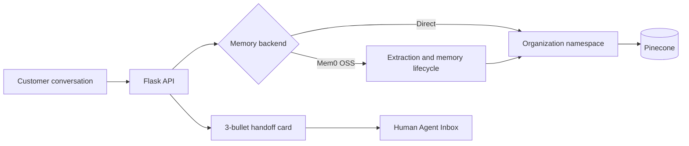

# QuickTalk Organizational Memory Service

A small Flask service that gives contact-center agents persistent customer
memory backed by Pinecone. Every memory is associated with an organization,
session, mobile number, and timestamp. The Human Agent Inbox displays an
exactly three-bullet handoff summary before the agent replies.

## Features

- Organization isolation through one Pinecone namespace per organization
- Customer isolation through normalized mobile-number metadata filters
- Session-aware memory storage and semantic retrieval
- Three-bullet Agent Handoff Context Card
- Local JSON fallback for development without Pinecone credentials
- Optional Mem0 OSS extraction and lifecycle infrastructure on Pinecone
- Responsive Human Agent Inbox demo
- API validation and isolation tests

## Quick start

```bash
python -m venv .venv
# Windows: .venv\Scripts\activate
# macOS/Linux: source .venv/bin/activate
pip install -r requirements.txt
python flask_app.py
```

Open <http://localhost:8765>. The app uses a local fallback until
`PINECONE_API_KEY` is set.

## Pinecone setup

Create a dense cosine index with 384 dimensions, then configure:

```env
PINECONE_API_KEY=your-key
PINECONE_INDEX=quicktalk-memories
PINECONE_DIMENSION=384
PORT=8765
```

Copy `.env.example` to `.env`; `.env` is excluded from Git. See
[FLASK_PINECONE_SERVICE.md](FLASK_PINECONE_SERVICE.md) for API examples and
implementation details.

## Enable Mem0 infrastructure

Mem0 can replace the direct vector adapter while preserving the same Flask API:

```env
MEMORY_BACKEND=mem0
OPENAI_API_KEY=your-openai-key
PINECONE_API_KEY=your-pinecone-key
MEM0_PINECONE_INDEX=quicktalk-mem0
```

The Mem0 adapter creates a separate Pinecone namespace for every organization
and hashes `organization_id + mobile_no` into its `user_id`. Session, mobile,
role, and timestamp remain attached as metadata. Keep `MEMORY_BACKEND=pinecone`
for the deterministic direct-Pinecone/local mode.

## API overview

| Method | Endpoint | Purpose |
|---|---|---|
| `GET` | `/api/health` | Service and backend status |
| `POST` | `/api/memories` | Save a customer or assistant memory |
| `GET` | `/api/memories` | Search isolated customer memories |
| `GET` | `/api/inbox/context-card` | Return the three handoff bullets |

## Test

```bash
python -m unittest -v test_flask_service.py
```

## Docker

```bash
docker build -t quicktalk-memory .
docker run --rm -p 8765:8765 --env-file .env quicktalk-memory
```

## Architecture



For production, replace the deterministic demo embedding function with the
organization's approved embedding model and create the Pinecone index using
that model's vector dimension.
