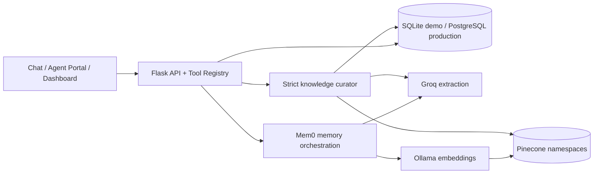

# QuickTalk Organizational Memory Platform

A Flask-based, multi-tenant support-memory service using Mem0, Pinecone, Groq and structured analytics. It provides cross-session customer recall, contextual welcomes, concise human-agent handoffs, approved human-agent knowledge, missing-topic analytics and organization-specific response tone.

## Current status

- Flask service and tool calling are implemented.
- Mem0 + Groq + Pinecone passed a real save/search smoke test.
- Tenant and customer isolation are enforced in retrieval.
- Strict agent-knowledge curation rejects incomplete or non-generalizable chats.
- Organization tone is applied to customer-facing responses with a fast fallback.
- Automated tests and GitHub Actions are passing.

## Test the running application

- Customer chat and handoff: <http://127.0.0.1:8765/custom>
- Agent chat and knowledge review: <http://127.0.0.1:8765/knowledge>
- Organization analytics: <http://127.0.0.1:8765/dashboard>
- Tool catalog: <http://127.0.0.1:8765/tools>
- Health: <http://127.0.0.1:8765/api/health>

## Quick start

```bash
python -m venv .venv
# Windows: .venv\Scripts\activate
# macOS/Linux: source .venv/bin/activate
pip install -r requirements.txt
copy .env.example .env  # Windows
# cp .env.example .env  # macOS/Linux
python flask_app.py
```

Run all tests:

```bash
python -m pytest -q
```

## Recommended configuration

Secrets belong only in `.env`. Never commit them or expose provider keys to the browser.

```env
PORT=8765
SERVICE_API_KEY=generate-a-long-random-secret

MEMORY_BACKEND=mem0-groq
PINECONE_API_KEY=your-pinecone-key
MEM0_PINECONE_INDEX=quicktalk-mem0-free
PINECONE_CLOUD=aws
PINECONE_REGION=us-east-1

# Separate workloads reduce shared Groq rate-limit contention
GROQ_MEMORY_API_KEY=your-memory-extraction-key
GROQ_SUMMARY_API_KEY=your-summary-key
GROQ_KNOWLEDGE_API_KEY=your-knowledge-and-tone-key
GROQ_SUMMARIZER_ENABLED=true
MEM0_GROQ_MODEL=llama-3.3-70b-versatile

OLLAMA_BASE_URL=http://localhost:11434
MEM0_LOCAL_EMBEDDING_MODEL=nomic-embed-text:latest
MEM0_LOCAL_EMBEDDING_DIMENSION=768

ANALYTICS_DB_PATH=data/analytics.db
AGENT_HISTORY_JSON=/absolute/path/to/agent_chat_history.json
```

`GROQ_API_KEY` remains a backward-compatible fallback when workload-specific keys are omitted.

## Architecture



- **Flask:** validation, authentication boundary, tenant enforcement, REST APIs and model-compatible tool dispatch.
- **Mem0:** durable conversational-memory extraction and semantic cross-session recall.
- **Pinecone:** organization-namespaced vector retrieval with customer/session/article metadata.
- **SQLite:** authoritative demo store for messages, profiles, summaries, analytics, knowledge lifecycle and audits. Use PostgreSQL in production.
- **Groq:** summaries, strict knowledge curation, memory extraction and tone rewriting. It is not a database.
- **Redis (optional production):** shared cache for active profiles; the demo uses local TTL caching.

## Answer and memory flow

1. Chat opens: load the contextual welcome and organization tone.
2. If the question explicitly asks about personal history, search that customer's tenant-scoped Mem0 history.
3. General questions skip customer memory and search bot KB first, then approved human-agent knowledge.
4. If both miss: return a safe apology and record a missing-knowledge event.
5. Apply organization tone to the final customer-facing answer.
6. Save customer and assistant messages with organization, mobile, session and timestamp.
7. On human handoff: return three curated bullets plus recent session summaries and counts.

Tone uses one Groq attempt with a two-second timeout. If unavailable, the original grounded response is returned unchanged.

## Complete Flask tool catalog

Tools use `POST /api/tools/<tool_name>/invoke` with `{"arguments": {...}}`.

| Tool | Active when | What it does |
|---|---|---|
| `save_customer_memory` | After customer/assistant messages | Saves tenant/customer/session-scoped memory and analytics. |
| `search_customer_memory` | Customer explicitly asks about prior/personal context | Recalls that customer's prior conversations; general policy questions skip Mem0. |
| `get_customer_memory_context` | New session initialization | Returns recent profile, current issue, previous-session count and summaries. |
| `get_contextual_welcome` | Chat opens or identity changes | Creates a returning-customer welcome and applies organization tone. |
| `get_handoff_context` | Human escalation | Returns three concise bullets, counts and expandable session summaries. |
| `get_organization_tone_profile` | Behind responses or manual testing | Returns style-only guidance; never factual knowledge. |
| `get_knowledge_curation_policy` | Agent chat close or manual testing | Returns tenant rules controlling reusable knowledge. |
| `search_approved_knowledge` | Bot KB miss or manual testing | Searches active, current-version, approved human-agent knowledge. |
| `resolve_support_answer` | Customer memory cannot answer | Searches bot KB, then agent knowledge, then apologizes and records a gap. |
| `get_missing_knowledge_topics` | Dashboard/report request | Aggregates questions neither source could answer; no LLM call is required. |
| `import_agent_history_from_json` | Explicit admin backfill | Starts resumable historical ingestion; never runs in the normal live path. |

List live schemas:

```bash
curl http://127.0.0.1:8765/api/public/tool-catalog
```

Invoke a tool:

```bash
curl -X POST http://127.0.0.1:8765/api/tools/resolve_support_answer/invoke \
  -H "Content-Type: application/json" \
  -H "X-API-Key: $SERVICE_API_KEY" \
  -H "X-Organization-Scope: nayatel" \
  -d '{"arguments":{"organization_id":"nayatel","session_id":"session-100","mobile_no":"+923001234567","query":"Can I upgrade my package?"}}'
```

## Strict human-agent knowledge

Closing an agent chat does **not** make every reply reusable. The curator and deterministic validator accept only complete, standalone, generally applicable answers.

Accepted:

- Complete troubleshooting procedures.
- Official service rules with all conditions.
- Policies/regulations with organization scope and effective/version context.
- Prices with currency, applicable product/service and effective/current period.

Rejected:

- Greetings, thanks, urgency and filler.
- Clarification, transfers and “another team will assist” replies.
- Missing prices or incomplete answers.
- Ambiguous replies that require the original chat.
- Customer-specific accounts, appointments, tickets, medical details or transactions.
- Guesses, obsolete rules and unscoped regulations.

Reviewable prompts:

- [`prompts/knowledge_curator.txt`](prompts/knowledge_curator.txt)
- [`prompts/tone_response.txt`](prompts/tone_response.txt)

Admins can update rules with `PUT /api/knowledge/policy`. Editing an article creates a new active version; disabled, deleted and superseded versions cannot be used even if an old vector remains in Pinecone.

## Main REST APIs

| Method | Endpoint | Purpose |
|---|---|---|
| `GET` | `/api/health` | Backend/cache health. |
| `GET` | `/api/tools` | Protected tool schemas. |
| `GET` | `/api/public/tool-catalog` | Public schemas without credentials. |
| `POST` | `/api/memories` | Direct memory ingestion. |
| `GET` | `/api/profiles/<mobile>` | Optimized customer profile and summaries. |
| `GET` | `/api/analytics/dashboard` | Tenant/time-scoped analytics. |
| `POST` | `/api/agent-chats` | Create a human-agent session. |
| `POST` | `/api/agent-chats/<id>/messages` | Store transcript messages. |
| `POST` | `/api/agent-chats/<id>/close` | Close and strictly curate reusable knowledge. |
| `GET` | `/api/knowledge/articles` | List organization knowledge. |
| `PATCH` | `/api/knowledge/articles/<id>` | Create a newer active version. |
| `POST` | `/api/knowledge/articles/<id>/status` | Activate, disable or delete. |
| `PUT` | `/api/knowledge/policy` | Update tenant curation rules. |

## Tenant and version safety

- Every vector operation uses an organization namespace.
- Customer recall filters by normalized mobile identity.
- Flask rejects claimed/argument organization mismatches.
- SQLite is authoritative for article status and active version.
- Pinecone candidates are discarded when relational status/version is stale.
- Production must derive organization and role from authenticated claims.

## Analytics

SQLite stores structured events, categories, sentiment, resolution state, summaries and missing-knowledge events. Dashboard totals use deterministic database aggregation. Groq may summarize/classify text but does not calculate authoritative totals.

## Historical imports

Set `AGENT_HISTORY_JSON`, then run as needed:

```bash
python import_agent_history.py
python import_agent_knowledge.py
python import_all_org_mem0.py
```

Checkpoints/errors are local runtime artifacts ignored by Git.

## Negative and release testing

```bash
python -m pytest -q
python negative_live_pinecone_test.py
python pinecone_integration_test.py
```

Tests cover malformed input, roles/timestamps, wrong keys, mobile/tenant isolation, strict rejection, active-version enforcement, memory recall, tone fallback and missing-topic recording.

## Docker

```bash
docker build -t quicktalk-memory .
docker run --rm -p 8765:8765 --env-file .env quicktalk-memory
```

## Production checklist

- Replace SQLite with PostgreSQL and optionally a warehouse.
- Derive tenant/user/role from signed authenticated claims.
- Use a secrets manager and rotate any key shared in chat.
- Remove browser-embedded demo authentication and use real login/session middleware.
- Add Redis for shared profile caching.
- Add an outbox/queue, retries, dead-letter handling and reconciliation for Pinecone/imports.
- Add TLS, rate limits, monitoring, backups, retention/deletion and encryption controls.

See [`IMPLEMENTATION_GUIDE.md`](IMPLEMENTATION_GUIDE.md) and [`TOOL_ACTIVATION_MATRIX.md`](TOOL_ACTIVATION_MATRIX.md) for deeper detail.
